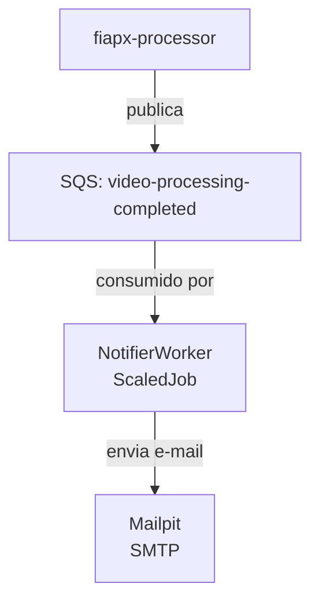

# FiapX.Notifier

Serviço responsável por notificar usuários sobre o resultado do processamento de vídeos no ecossistema FIAP X.

Consome a fila SQS `fiapx-{env}-video-processing-completed` e envia e-mails via SMTP para os usuários afetados.

## Definição do ambiente

- SDK: .NET 8.0
- Mensageria: Amazon SQS
- SMTP: Mailpit (local)



## Pré-requisitos

Certifique-se de ter provisionado o ambiente executando os scripts do
[repositório de infraestrutura](https://github.com/13soat-fiapx/fiapx-infra).

Para rodar localmente, é necessário ter o Docker em execução. O `docker-compose.yml` sobe o LocalStack e o Mailpit.

```powershell
docker compose up -d
```

## Como executar localmente

```powershell
dotnet run --project .\src\FiapX.Worker
```

## Script de deploy

Execute o script PowerShell para compilar a imagem e publicar no ECR.

```powershell
.\scripts\deploy-image.ps1 dev
```

## Mensageria

### Consumers

| Fila                                      | Descrição                                                  |
|-------------------------------------------|------------------------------------------------------------|
| `fiapx-{env}-video-processing-completed`  | Notifica o usuário sobre o resultado do processamento.     |

## Observabilidade

O serviço exporta traces, métricas e logs via OpenTelemetry direto para o intake OTLP do
Datadog, sem Agent ou Collector. A integração é encapsulada no projeto
`FiapX.Infra.Observability`.

Em execução local, a observabilidade fica desligada por padrão (a aplicação loga
`Observability disabled: Datadog API key or OTLP endpoint not configured` na inicialização).
Em cluster, a key chega via secret `observability/datadog-api-key`, espelhada para o namespace
do serviço pelo Reflector como `notifier-datadog`; se a secret não existir, o serviço sobe
normalmente com a observabilidade desligada.

Por ser um `ScaledJob` de execução única, o worker faz `ForceFlush` do `TracerProvider` e do
`MeterProvider` antes de encerrar, garantindo que a telemetria da execução seja exportada.

Detalhes de arquitetura, configuração e troubleshooting:
[Observabilidade](https://github.com/13soat-fiapx/fiapx-docs/blob/main/docs/observability.md).

## Links úteis

- [fiapx-infra](https://github.com/13soat-fiapx/fiapx-infra)
- [fiapx-processor](https://github.com/13soat-fiapx/fiapx-processor)
